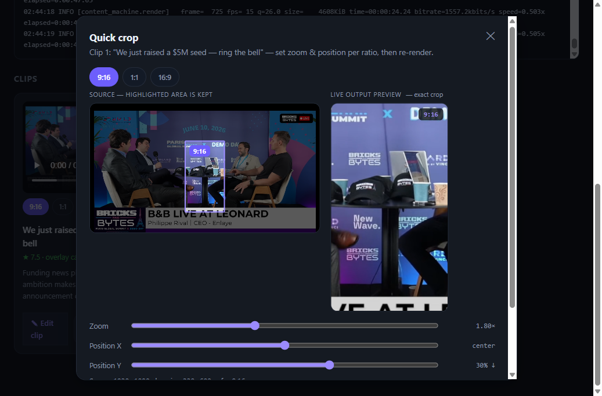
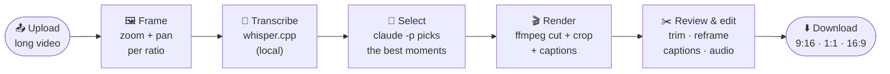
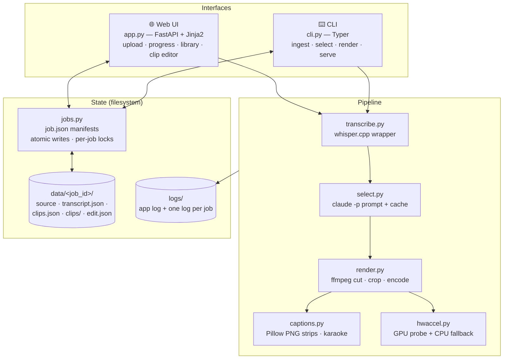
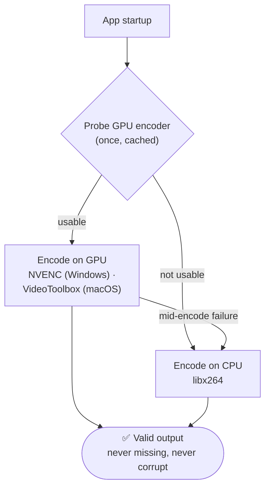

# 🎬 Content Machine

**Turn one long video into a stack of ready-to-post social clips — locally, privately, at zero marginal cost.**


Drop in a talk, webinar, or podcast recording. Content Machine transcribes it on your own hardware, has Claude pick the most clip-worthy moments, and renders each one in **9:16, 1:1, and 16:9** with burned-in captions — ready for LinkedIn, Shorts, Reels, or TikTok.

**Your video never leaves your machine.** Transcription runs locally with whisper.cpp, rendering runs locally with ffmpeg, and clip selection runs through your existing **Claude Code subscription** — no API key, no per-token bill, no cloud upload.

## Why Content Machine?

| | |
|---|---|
| 🔒 **Local-first & private** | Everything lives in `data/<job_id>/` on your disk. Nothing is uploaded anywhere. |
| 💸 **No API costs** | Clip selection shells out to `claude -p` on your Claude Code subscription. One cached call per transcript. |
| 📐 **Three formats in one pass** | Every clip renders as 9:16, 1:1, and 16:9 — each with its own zoom and pan you frame live before the run. |
| 🎤 **Word-level karaoke captions** | Captions driven by whisper's per-word timings — classic phrase overlays or word-by-word karaoke highlight. |
| ⚡ **GPU-accelerated, never fragile** | Hardware H.264 encode (NVENC / VideoToolbox) when your GPU can do it, silent fallback to CPU when it can't. An output is never missing or corrupt. |
| ✂️ **A real clip editor** | Trim with snap-to-word, reframe per ratio, rewrite caption text and timing, mute or adjust audio — non-destructive, per clip. |
| 🔁 **Crash-safe & cached** | Every stage is checkpointed. Re-runs reuse the transcript and selection; a crash resumes from the last completed stage. |
| 📊 **Honest progress** | A weighted master bar plus live per-stage bars (real whisper %, per-clip render counts) and a live tail of the job log. |



*The Quick Crop modal: pick zoom + position per aspect ratio against a live, exact-crop preview — no test renders needed.*

## How it works

The whole pipeline is five stages, each staged to disk and resumable:



| Stage | Tool | Output |
|-------|------|--------|
| **Transcribe** | whisper.cpp (Metal on Mac, BLAS on Windows), 16 kHz mono via ffmpeg; silence-VAD drops hallucinations | `data/<job>/transcript.json` |
| **Select** | `claude -p` (subscription, headless) returns segment-index ranges → clips snap to sentence boundaries; cached by transcript hash | `data/<job>/clips.json` |
| **Render** | ffmpeg accurate cut + crop/scale reframe + caption overlay, per aspect | `data/<job>/clips/clipNN/{9x16,1x1,16x9}.mp4` |
| **Captions** | Pillow PNG strips composited via ffmpeg `overlay` — phrase mode (default) or word-level karaoke | burned into every clip |
| **Library** | plain filesystem: `data/<job_id>/` + `job.json` manifest | browsable in the web UI |

## Quick start

### Windows (no package manager needed)

```powershell
powershell -ExecutionPolicy Bypass -File scripts\setup.ps1   # vendors static ffmpeg + prebuilt whisper.cpp + model + venv
.venv\Scripts\python.exe -m content_machine.cli serve        # http://127.0.0.1:8000
```

`setup.ps1` downloads a **pinned, NVENC-capable ffmpeg 7.1** build and the prebuilt
`whisper-blas-bin-x64` release into `vendor/` (gitignored) — no Homebrew, cmake, or
compiler required. (ffmpeg is pinned to 7.1 because bleeding-edge builds need NVIDIA
driver ≥ 610 for NVENC; 7.1's NVENC works on current drivers. If NVENC can't init,
the app just uses CPU x264.)

### macOS / Apple Silicon

```bash
bash scripts/setup.sh          # ffmpeg + cmake, build whisper.cpp (Metal), model, venv
source .venv/bin/activate

# CLI
content-machine ingest path/to/talk.mp4      # -> transcript
content-machine select <job_id>              # -> clips.json (via claude -p)
content-machine render <job_id>              # -> 9:16 / 1:1 / 16:9 + captions

# or the web UI (upload → review → download)
content-machine serve                        # http://127.0.0.1:8000
```

**Prerequisites (both platforms):** Python ≥ 3.11 and **Claude Code logged in**
(`claude login`) — the selection step uses your subscription, not an API key.
macOS additionally needs Homebrew.

## Architecture

A small FastAPI app and a Typer CLI drive the same pipeline modules. State is just
files on disk — no database, no queue service.



Shared crop math lives in one place — `content_machine/static/crop.js` for the live
browser preview and a Python parity test that guarantees the render matches what you
framed (WYSIWYG for real).

## ⚡ Hardware acceleration

The render's H.264 **encode** is offloaded to your GPU when possible; decode and the
crop/scale/caption filters stay on the CPU (mixing GPU decode with CPU filters is
fragile, so we don't). The GPU encoder is probed **once at startup** and the verdict
cached; any failure — at probe time or mid-encode — transparently falls back to
`libx264`.



| Platform | Encoder | Transcribe |
|----------|---------|-----------|
| **Windows** (NVIDIA) | `h264_nvenc` (NVENC) — needs the pinned ffmpeg 7.1 | CPU whisper (BLAS) — ~9× realtime |
| **macOS** (Apple Silicon) | `h264_videotoolbox` | whisper.cpp **Metal** (GPU) |
| no usable GPU | `libx264` (CPU) | CPU whisper |

Measured numbers and the reasoning behind these choices (including why Windows GPU
*transcription* is intentionally **not** used on Blackwell GPUs) are in
[`BENCHMARKS.md`](BENCHMARKS.md). Run your own:

```
python scripts/benchmark.py your-video.mp4 --seconds 30
```

Force CPU encoding (A/B test, or if you suspect a GPU issue): set `CM_FORCE_CPU=1`.

## The clip editor

Every rendered clip gets a full editor at `/job/<id>/clip/<n>/edit`:

- **Trim** with snap-to-word — cut points snap to whisper's word timings, so clips never start or end mid-word.
- **Reframe** per aspect ratio — independent zoom + x/y pan for 9:16, 1:1, and 16:9, with a live exact-crop preview.
- **Captions** — edit text and timing per phrase; switch between `overlay` (per-phrase) and `karaoke` (word-by-word highlight) modes.
- **Audio** — mute or adjust gain.

Edits are saved **non-destructively** to `edit.json` and re-rendered per aspect — only the ratios you changed re-encode.

## Project layout

```
content_machine/        config, jobs, transcribe, select, render, captions, hwaccel,
                        app (FastAPI), cli (Typer), logging_setup
  static/crop.js        shared crop math (browser preview ↔ Python render parity)
  templates/            index.html, job.html, editor.html
scripts/setup.{sh,ps1}  one-shot local setup (macOS / Windows)
scripts/benchmark.py    GPU-vs-CPU render benchmark + ffprobe validation
tests/                  pytest unit + HTTP + Playwright E2E
vendor/                 ffmpeg + whisper.cpp, fetched by setup (gitignored)
data/                   your videos, transcripts, clips (gitignored, local-only)
.planning/              GSD planning: roadmap, research, per-phase plans/summaries
```

## Logs

Every run is logged so nothing is a black box:

- `logs/content_machine.log` — rotating app-wide log (all jobs, requests, errors).
- `logs/jobs/<job_id>.log` — one file per job; the **job page tails this live** under
  "📜 Live log", so you can watch transcribe → select → render and see the exact
  error if a stage fails.

```bash
tail -f logs/content_machine.log        # follow everything
tail -f logs/jobs/<job_id>.log          # follow one job
```

## Tests & quality

```bash
make test                              # unit + HTTP (pytest, with coverage)
make lint                              # ruff
pytest -m "e2e and not slow"           # Playwright UI E2E (needs: pip install pytest-playwright; playwright install chromium)
make e2e-seed                          # seed a real fixture job for manual/Playwright QA
```

- **~211 unit/HTTP tests** (pytest, ~92% line coverage) + **34 Playwright UI E2E specs** +
  a JS↔Python crop-math parity test (Node) + a real-ffmpeg render E2E.
- CI ([`.github/workflows/test.yml`](.github/workflows/test.yml)) runs ruff + the unit
  suite, with a separate job for the Playwright E2E suite.
- Accessibility: the UI passed a WCAG 2.1 AA pass (keyboard navigation, focus management,
  ARIA live regions for progress).

## Design decisions & known constraints

- **Subscription headless (`claude -p`) is the only selection path — by design.** It draws
  from your normal 5-hour/weekly Claude limits, and Anthropic's consumer terms restrict
  scripted access — an accepted risk, mitigated by caching one call per transcript. To
  switch to an API key later, the selection call is isolated in `select.run_claude`.
- **Captions are PNG overlays, not burned drawtext** — works with *any* ffmpeg build,
  including stripped ones without libass/drawtext.
- **Karaoke captions** composite one overlay per word, so they encode slower on long,
  wordy clips — they're opt-in; the default per-phrase `overlay` mode is fast. The richer
  **hyperframes** animated caption path is wired behind the same mode but needs Node ≥ 22
  + headless Chrome; on any machine without them (or any failure) it falls back
  automatically to PNG karaoke.
- **Reframing is a manual per-aspect transform** — independent zoom + x/y pan per ratio,
  set live before the run and per clip in the editor. Speaker-tracking auto-reframe is
  deferred (needs CV; see `.planning/REQUIREMENTS.md`).

---

Built with GSD — see [`.planning/`](.planning/) for the roadmap, research, and per-phase
plans/summaries (milestone **v6 — Full Quality Pass** hardened reliability and added the
test suites + CI, the accessibility pass, word-snapping, and karaoke captions).
